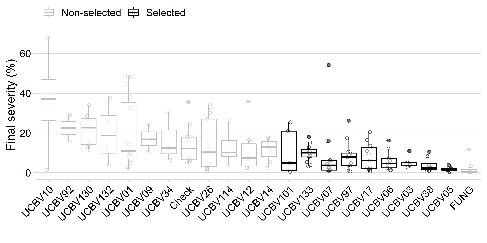

% Introduction

 In this website are available the codes used to reproduce the analysis and results of the research conducted by the master student Hiago Antonio O. da Silva under the supervision of Prof. Lucas Magalhães de Abreu at theUniversidade Federal de Vicosa, MG, Brazil.

  

## Citation

The research compendium with all files for reproducing the work and generating the figures, as well as this website, are available as an OSF project and can be cited as follows:

Alves, K. S., & da Silva, H. A. O. (2020, February 10). Research Compendium: Control of tomato early blight with Clonostachys spp. and metabolites crude extract. https://doi.org/10.17605/OSF.IO/WDG5P

