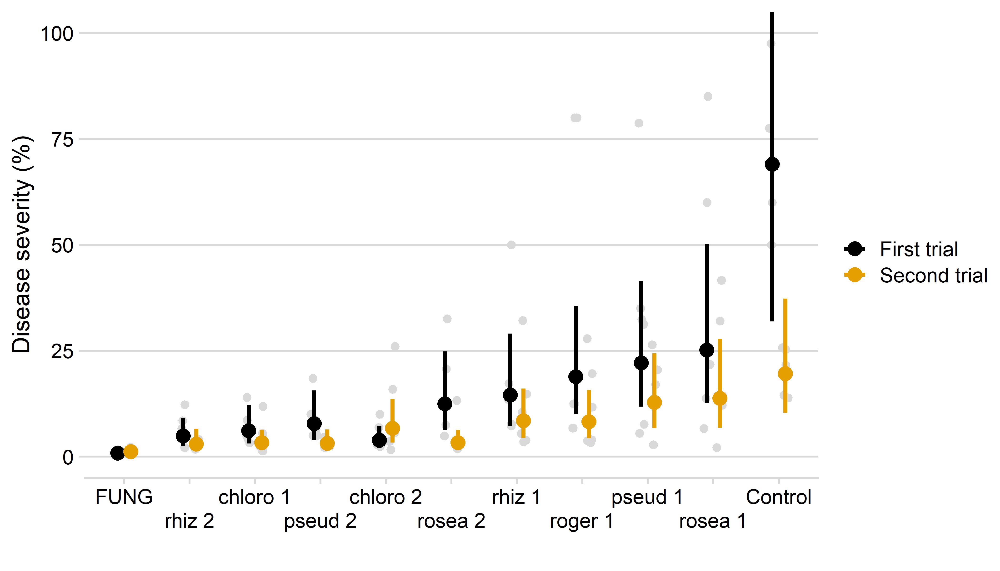

% About

 In this website are available the codes used to reproduce the analysis and results of the research conducted by a D.sc student Hiago Antonio O da Silva under the supervision of Prof. Lucas M. de Abreu, Universidade Federal de Vicosa, MG, Brazil.

   

## Citation
  Alves, K. S., & da Silva, H. A. O. (2020, February 10). Research Compendium: Biocontrol of Potato Early Blight with different Clonostachys spp. species. https://doi.org/10.17605/OSF.IO/F7VPB
 

